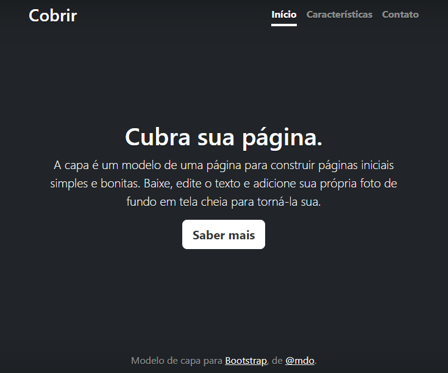

# Indice

* [Projeto - Portifólio para escrita do README](#projeto---portif%C3%B3lio-para-escrita-do-readme)  
* [Descrição](#descri%C3%A7%C3%A3o)  
* [Funcionalidades](#funcionalidades)  
* [Tecnologia ultilizadas](#tecnologia-ultilizadas)   
* [Fontes consultadas](#fontes-consultadas)   
* [https://gist.github.com/lohhans/f8da0b147550df3f96914d3797e9fb89](#httpsgistgithubcomlohhansf8da0b147550df3f96914d3797e9fb89)  
* [https://www.alura.com.br/artigos/escrever-bom-readme](#httpswwwaluracombrartigosescrever-bom-readme)    
* [Autores](#autores)  

# 🚀 Projeto - Portifólio para escrita do README

## 📋Descrição 
 

## 🔧 Funcionalidades

### 🛠️ Tecnologia ultilizadas 
* HTML  
* CSS  
* README  

## 📄 Fontes consultadas 

## https://gist.github.com/lohhans/f8da0b147550df3f96914d3797e9fb89

## https://www.alura.com.br/artigos/escrever-bom-readme

## ✒️ Autores

* Maria Eduarda Simões Almeida - Documentação 

